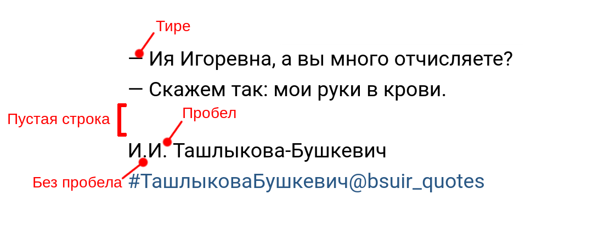

# Quotes style guide v.1.0

## Цели

- Единый вид постов
- Культура сообщества
- Упрощение поиска цитат конкретного преподавателя
- Облегчение жизни админам :)

## Пример

## Описание

- Пост начинается с собственно цитаты
- К цитате должны быть применены правила орфографии и пунктуации
(исключением может являться случай, когда необходимо подчеркнуть произношение фразы), в том числе:
  - Реплики диалога начинаются с тире "—" (не с дефиса "-")
  - Перед запятой пробела нет, после — есть
- После цитаты следует пустая строка
- Далее располагаются инициалы и фамилия преподавателя
  - Первыми идут инициалы
  - Между инициалами пробелов нет
  - Инициалы отделены от фамилии пробелом
- В последней строке расположен хэштег формата #ФамилияПреподавателя@bsuir_quotes
  - В случае двойной фамилии дефис опускается
- В особых случаях возможно отклонение от правил, но хэштег должен быть всегда
- Пулл-реквесты приветствуются
